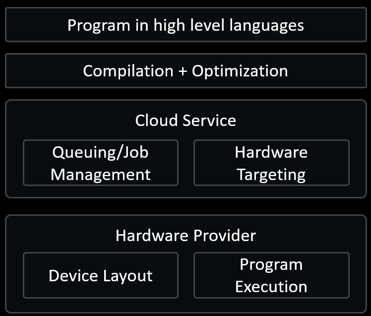

# GitHub Universe CMT014 | [Open source quantum development with Codespaces](https://githubuniverse.com/events/detail/virtual-schedule/00191b20-fdaa-4930-9)

 
>See the [schedule](https://githubuniverse.com/events/detail/virtual-schedule/00191b20-fdaa-4930-9), [demo](https://github.com/crazy4pi314/universe-qir-demo) and [recording](https://githubuniverse.com/events/detail/virtual-schedule/00191b20-fdaa-4930-9) (with [free registration](https://register.githubuniverse.com/) for Universe).

Building a new open source community can be challenging, especially when it involves cutting edge technology like quantum computers. The **QIR Alliance** is developing open source specifications and tooling to help connect the quantum hardware into our traditional computation stack **built on top of LLVM**. Enriching popular classical developer tools from Python to C++ with access to quantum accelerators, the QIR Alliance enables everyone to contribute to the development of quantum computing, including middleware integrators, hardware providers, domain experts, students, and educators. Join us, and see how the QIR Alliance uses **Codespaces** to make it easy for all to use and contribute to the open source quantum ecosystem.

## Try the demo! 💖

This repo contains an end-to-end demo of a quantum development stack that connects quantum programs written in Python to compiler and optimization tools and finally to a simulator (Rust) or hardware to run the quantum program.
The demo can run in your browser with [Codespaces](https://github.com/features/codespaces), or if you prefer, you can run it locally by cloning the repo and starting the included [Dev Container](https://containers.dev/).
The code is in the `demo.ipynb` [Jupyter notebook](https://jupyter.org/), which runs both the Python and command line tools needed for the demo.
Many of the showcased open source tools are maintained by the [QIR Alliance](https://www.qir-alliance.org/), a Linux Foundation project that is developing both a specification for describing quantum programs and the tools needed to interoperate with the spec.

The quantum computing stack can be thought of like this figure below:

All of these layers are connected by *QIR*, a low-level intermediate representation like LLVM that is designed to be easy to translate quantum programs between languages and hardware providers.
You can read the [specification for QIR](https://github.com/qir-alliance/qir-spec) on the qir-spec repo, which is still in active development.

To write the quantum program, we use the [QuTiP](https://qutip.org/) Python package, which is one of the most popular quantum OSS tools for writing and simulating quantum systems.
The sample quantum program provided demonstrates moving information from one place in the device to another, very similar to the C Move operation.

Now we need to get to the compiler and optimization layer.
To do this we can use a Rust tool with Python bindings called [PyQIR](https://github.com/qir-alliance/pyqir) to convert the QuTiP program into a QIR program.
PyQIR is a QIR Alliance project, and can be used as a stand-alone [Rust crate](https://github.com/qir-alliance/pyqir/tree/main/qirlib) that interfaces QIR and LLVM APIs so you can write quantum Rust programs out of the box.

In the compiler layer we use the QIR Alliance tool [qat](https://github.com/qir-alliance/qat) that allows us to run LLVM optimization passes on the QIR program.
This is really cool to see because it means that we can use the same tools that we use for classical code (LLVM passes) to optimize quantum code right out of the box.
Qat also supports optimizations specific to quantum code, and the ability to target QIR program to different simulator and hardware capabilities.
This is important because the quantum hardware and simulators all have very different architectures, and it's critical to be able to verify that the code will run on the expected target.

Finally, we need to run the quantum program.
This demo has two execution options: a Rust simulator ([qir-runner](https://github.com/microsoft/qir-runner)) and an [Azure Quantum](https://azure.microsoft.com/en-us/products/quantum/#overview) hardware provider, [Rigetti](https://www.rigetti.com/).

> The video recording of the demo uses a simulator target from Rigetti for queue times, but you can also run on Rigetti's hardware by [changing the `target` variable](https://pypi.org/project/azure-quantum/) in the `azure.quantum.Job.from_input_data` function in the demo notebook.

If you have any questions or feedback, please feel free to [open an issue](https://github.com/crazy4pi314/universe-qir-demo/issues), ping me on [Mastodon](https://mathstodon.xyz/@crazy4pi314) or  Discord (crazy4pi314 (she/her)#1592) or [join a QIR community call](https://discord.gg/unitary-fund-764231928676089909) and chat with the users and maintainers of QIR tools.

## Cool QIR Projects to explore

- [GitHub Codespaces](https://github.com/features/codespaces)
- [Jupyter Notebooks](https://jupyter.org/)
- [QIR Spec](https://github.com/qir-alliance/qir-spec) and the [QIR Alliance](https://www.qir-alliance.org/)
- [qutip/qutip](https://qutip.org/)
- [qir-alliance/pyqir](https://github.com/qir-alliance/pyqir)
- [qir-alliance/qat](https://github.com/qir-alliance/qat)
- [microsoft/qir-runner](https://github.com/microsoft/qir-runner)
